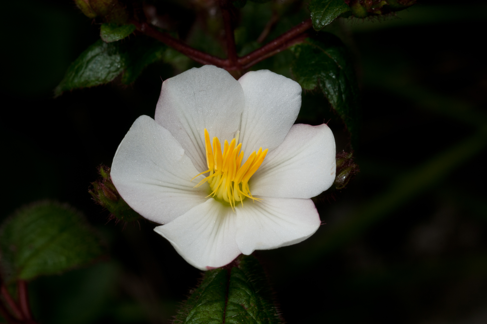
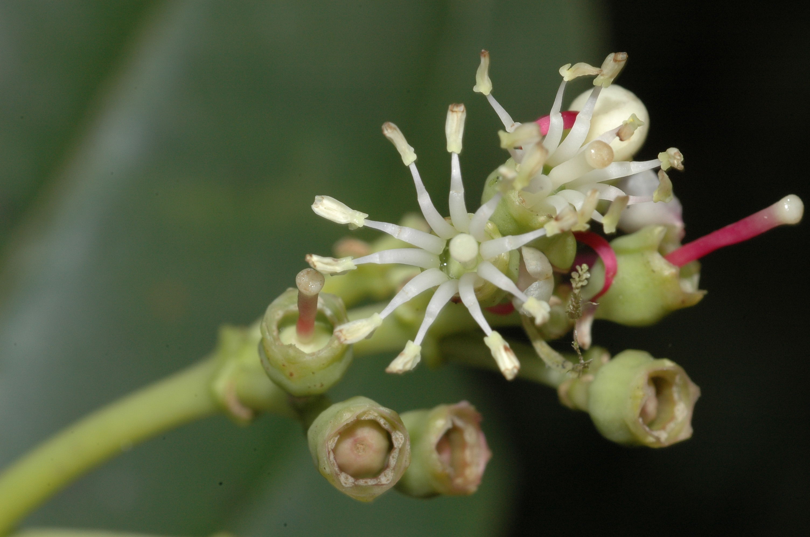
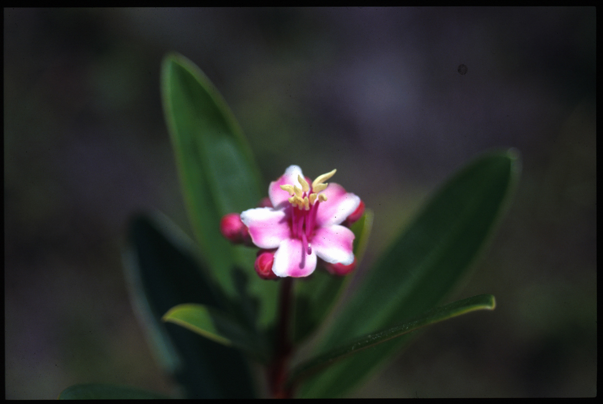
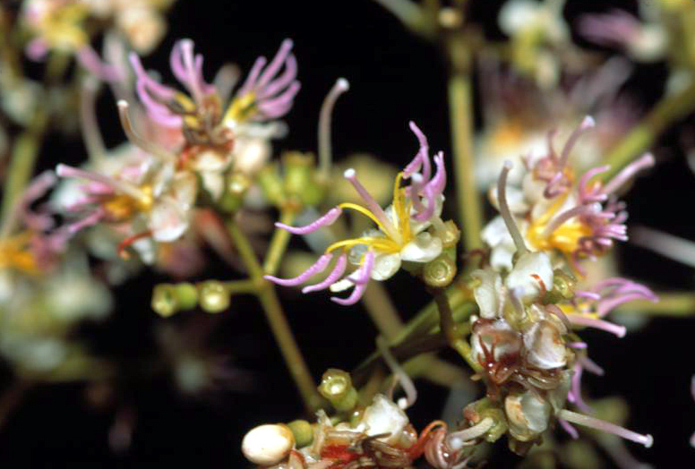
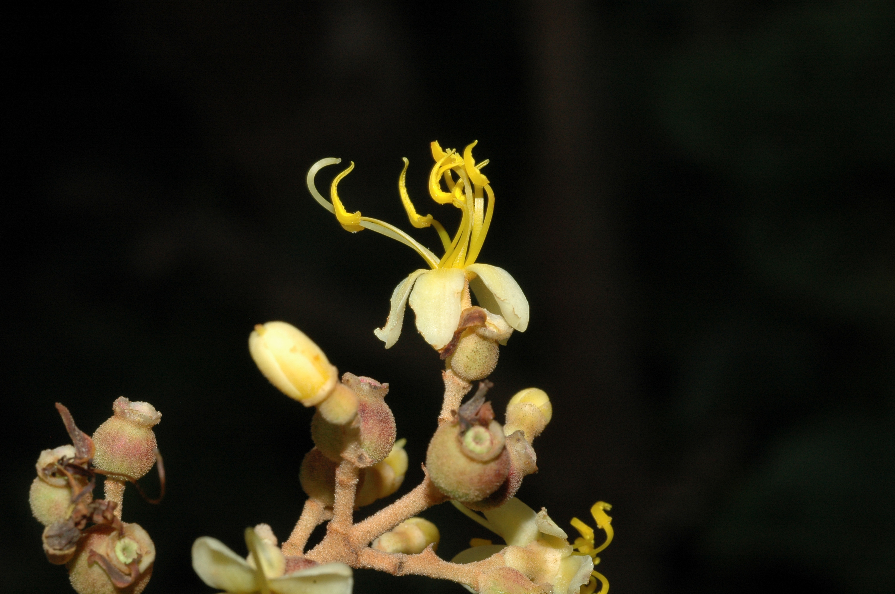

# Herbarium Challenge 2019 - FGVC6

The FGVC 2019 Herbarium Challenge challenge is to identify melastome species from herbarium specimens provided by the [New York Botanical Gardens](https://www.nybg.org/plant-research-and-conservation/) (NYBG). We have provided a curated dataset of over 46,000 herbarium specimens for over 680 species of the flowering plant family Melastomataceae.

	
	
	
	
	

## Background
There are more than 400,000 known plant species with an estimated 80,000 still to be discovered. In flowering plants, it takes approximately 35 years from plant collection to species description while less than 16% of new species are described in less than 5 years. It has also been suggested that ‘herbaria are a major frontier for species’ with more than 50% of unknown species already in herbarium collections.

	
	
	
	
	

The family Melastomataceae, also known as the princess flower family, has more than 5,000 named species. Many of its species have extraordinary flowers. However, botanists make many of the species determinations from pressed herbarium specimens. We have 46,469 herbarium specimens that represent 685 melastome species. In addition, some species are represented by more than a hundred specimens, while others are represented by 20 specimens.

The teams with the most accurate models will be contacted, with the intention of using them on the un-named melastome collections in the NYBG herbarium collection, and assessed by the NYBG melastome specialist.

## Kaggle
The leaderboard is being hosted on Kaggle ([challenge page](https://www.kaggle.com/c/herbarium-2019-fgvc6)).

## Dates
|||
|------|---------------|
Competition Starts|April 5, 2019|
Entry Deadline|June 1, 2019|
Team Merger Deadline|June 1, 2019|
Final Submission Deadline|June 7, 2019|

## Data Split and Evaluation
The training, validation and test set contain images of herbarium specimens, from 683 species of the flowering plant family Melastomataceae.

The data has been split 75%/5%/20% for training/validation/test. Each category has at least 15 instances in the training and validation datasets, and some categories have much more. Datasets are hosted on Google Cloud Platform.

This competition is evaluated on the top-1 accuracy of your predictions (the percentage of images you get correct).

## Submission File Format
The file should contain a header and have the format below. The Id is the filename of the image in the test set.

    Id,Category
    00000.jpg,0
    00001.jpg,1
    00002.jpg,2
    etc.

## Data
### Terms of Use
* You will use the data only for non-commercial research and educational purposes.
* You will NOT distribute the images.

### Full Dataset
For the full dataset, each image has been provided as a high-resolution image, and has not been resized in any way. All images are in JPEG format.

The training set ([train.tar.gz](https://storage.googleapis.com/nybg/herbarium-2019-fgvc6/train.tar.gz), 38 GB) contains 34,225 images, organized as subfolders `train/<category>/<id>.jpg`. Note that the image IDs are not unique across categories, e.g. `train/1/00000.jpg` and `train/2/00000.jpg` are both within the training set.

The validation set ([validation.tar.gz](https://storage.googleapis.com/nybg/herbarium-2019-fgvc6/validation.tar.gz), 3 GB) contains 2,679 images that are organized similarly to the training set, i.e. as subfolders `validation/<category>/<id>.jpg`.

The test set ([test.tar.gz](https://storage.googleapis.com/nybg/herbarium-2019-fgvc6/test.tar.gz), 11 GB) contains 9,565 images without category subfolders, organized as `test/<id>.jpg`.

In the submission, use the entire filename, e.g. `00123.jpg` as the Id column.

* `md5sum train.tar.gz` should produce `a`
* `md5sum validation.tar.gz` should produce `b`
* `md5sum test.tar.gz` should produce `c`

### Small Resized Dataset
For convenience, we have also provided a small resized dataset, where each image has been resized (preserving aspect ratios) to have a maximum of 1024 pixels in the larger dimension. The split for the resized dataset is identical to the full dataset, and the IDs also match (e.g. `test/00123.jpg` and `small-test/00123.jpg` are the same specimen). All images are in JPEG format.

The small training set ([small-train.tar.gz](https://storage.googleapis.com/nybg/herbarium-2019-fgvc6/small-train.tar.gz), 1.7 GB) is organized as subfolders `small-train/<category>/<id>.jpg`.

The small validation set ([small-validation.tar.gz](https://storage.googleapis.com/nybg/herbarium-2019-fgvc6/small-validation.tar.gz), 135 MB) is organized as subfolders `small-validation/<category>/<id>.jpg`.

The small test set ([small-test.tar.gz](https://storage.googleapis.com/nybg/herbarium-2019-fgvc6/small-test.tar.gz), 487 MB) is organized as `small-test/<id>.jpg`.

* `md5sum small-train.tar.gz` should produce `8bf1985008dea8f79da1d9668b065543`
* `md5sum small-validation.tar.gz` should produce `d7e8670238a54f13b8b729823a988004`
* `md5sum small-test.tar.gz` should produce `6da0ca3d5cb3c137cf7eebe93412c86f`

## Guidelines
The general rule is that participants should only use the provided training and validation images for training models to classify the test images. We do not want participants crawling the web in search of additional data or using previous versions of this dataset. Pretrained models may be used to construct the algorithms from publicly available academic datasets (e.g. ImageNet). Please specify any and all external data and/or models used for training when uploading results.

Participants are allowed to collect additional annotations on the provided training sets. Participants are not allowed to collect annotations on the test set. Teams should specify that they collected additional annotations when submitting results.

## About
This is an FGVCx competition hosted as part of the [FGVC6](https://sites.google.com/corp/view/fgvc6/home) workshop at CVPR 2019 and supported by the [New York Botanical Gardens](https://www.nybg.org/plant-research-and-conservation/) and [dataCommons](http://www.datacommons.org/).

### Acknowledgements
Data is provided by Barbara Ambrose and Melissa Tulig (New York Botanical Gardens).
