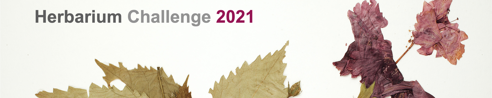

# Description 

*The Herbarium 2022: Flora of North America* is a part of a project of [New York Botanical Garden](https://www.nybg.org/) funded by the National Science Fundation to building tools to identify novel vascular plant species around the world. *The Herbarium 2022: Flora of North America* attempts to identify all vascular plant speciments from the entire North America, provided by 50 different institutions around the world. 

*The Herbarium 2022: Flora of North America*  dataset includes more than **1.05 M images** representing more than 90% of vascular land plants in the North America. Taxa names from our plant list is aligned to a standardized plant list [World Checklist of Vascular Plants; WCVP](https://wcvp.science.kew.org/) from the [Royal Botanical Garden](https://www.kew.org/).

This dataset has a long tail; there are a minimum of 7 images per taxon. A maximum number of images per taxon is set to 100 images, to ensure a reasonable size for training and testing.This dataset only includes vascular land plants which include lycophytes, ferns, gymnosperms, and flowering plants. The extinct forms of lycophytes are the major component of coal deposits, ferns are indicators of ecosystem health, gymnosperms provide major habitats for animals, and flowering plants provide almost all of our crops, vegetables, and fruits.

# Background

There are approximately 3,000 herbaria world-wide, and they are massive repositories of plant diversity data. These collections not only represent a vast amount of plant diversity, but since herbarium collections include specimens dating back hundreds of years, they provide snapshots of plant diversity through time. The integrity of the plant is maintained in herbaria as a pressed, dried specimen; a specimen collected nearly two hundred years ago by Darwin looks much the same as one collected a month ago by an NYBG botanist. All specimens not only maintain their morphological features but also include collection dates and locations, their reproductive state, and the name of the person who collected the specimen. This information, multiplied by millions of plant collections, provides the framework for understanding plant diversity on a massive scale and learning how it has changed over time. The models developed during this competition are an integral first step to speed the pace of species discovery and save the plants of the world.

There are approximately 400,000 known vascular plant taxa with an estimated 80,000 still to be discovered. Herbaria contain an overwhelming amount of unnamed and new specimens, and with the threats of climate change, we need new tools to quicken the pace of species discovery. This is more pressing today as a United Nations report indicates that more than one million species are at risk of extinction, and amid this dire prediction is a recent estimate that suggests plants are disappearing more quickly than animals. This year, we have expanded our curated herbarium dataset to vascular plant diversity in the Americas and Oceania. 

The most accurate models will be used on the unidentified plant specimens in our herbarium and assessed by our taxonomists thereby producing a tool to quicken the pace of species discovery.

# About

This is an FGVC competition hosted as part of the [FGVC9](https://sites.google.com/view/fgvc9/home) workshop at [CVPR 2022](https://cvpr2022.thecvf.com/) and sponsored by [NYBG](https://www.nybg.org/).

Details of this competition are mirrored on the [github](https://github.com/visipedia/herbarium_comp) page. Please post in the forum or open an issue if you have any questions or problems with the dataset.

# Acknowledgements

The images are provided by the [New York Botanical Garden](https://www.nybg.org/) and 59 more herbaria from North America and around the world.  

## Kaggle Competition

The leaderboard is being hosted on Kaggle ([challenge page](https://www.kaggle.com/c/herbarium-2021-fgvc8)).

### Dates
|||
|------|---------------|
Competition Starts|March 8, 2021|
Entry Deadline|May 24, 2021|
Team Merger Deadline|May 24, 2021|
Final Submission Deadline|May 31, 2021|

### Evaluation
Competition submissions are evaluated using the [macro F1 score](https://scikit-learn.org/stable/modules/generated/sklearn.metrics.f1_score.html).

F1 is calculated as follows:

where:

In "macro" F1 a separate F1 score is calculated for each `species` value and then averaged.

### Submission File Format

For each image `Id`, you should predict the image label in the `Predicted` column. The submission file should have the following format:

    Id,Predicted
    0,0
    1,27
    2,42
    ...

## Data 

The dataset is hosted on [Kaggle](https://www.kaggle.com/c/herbarium-2021-fgvc8/data).

The training and test set contain images of herbarium specimens from close to 65,000 species of vascular plants. Each image contains exactly one specimen. The text labels on the specimen images have been blurred to remove category information in the image.

The data has been approximately split 80%/20% for training/test. Each category has at least 1 instance in both the training and test datasets. Note that the test set distribution is slightly different from the training set distribution. The training set contains species with hundreds of examples, but the test set has the number of examples per species capped at a maximum of 10.

### Dataset Format
Each image has different image dimensions, with a maximum of 1000 pixels in the larger dimension. These have been resized from the original image resolution. All images are in JPEG format.

This dataset uses the [COCO dataset format](https://cocodataset.org/#format-data) with additional annotation fields. In addition to the species category labels, we also provide region and supercategory information.

The training set metadata (`train/metadata.json`) and test set metadata (`test/metadata.json`) are JSON files in the format below. Naturally, the test set metadata file omits the "annotations", "categories," and "regions" elements.

    { 
      "annotations" : [annotation], 
      "categories" : [category],
      "images" : [image],
      "info" : info,
      "licenses": [license],
      "institutions": [institution]
    }
    
    info {
      "year" : int,
      "version" : str,
      "url": str,
      "description" : str,
      "contributor" : str,
      "date_created" : datetime
    }

    image {
      "id" : int,
      "width" : int,
      "height" : int,
      "file_name" : str,
      "license" : int
    }

    annotation {
      "id": int,
      "image_id": int,
      "category_id": int,
      # Institution that provided this specimen.
      "institution_id": int
    }

    category {
      "id" : int,
      # Species name
      "name" : str,
      # We also provide the super-categories for each species.
      "family": str,
      "order": str
    }

    institution {
      "id": int
      "name": str
    }

    license {
      "id": int,
      "name": str,
      "url": str
    }

The training set images are organized in subfolders `train/images/<subfolder1>/<subfolder2>/<image id>.jpg`, where `<subfolder1>` combined with `<subfolder2>` corresponds to the `category_id`. For example, a training image with an `image_id` of `1104517` and a `category_id` of `00001`, can be found at `train/images/000/01/1104517.jpg`. 

The test set images are organized in subfolders `test/images/<subfolder>/<image id>.jpg`, where `<subfolder>` corresponds to the integer division of the `image_id` by 1000. For example, a test image with and `image_id` of `8005`, can be found at `test/images/008/8005.jpg`. 

### Terms of Use
* You will use the data only for non-commercial research and educational purposes.
* You will NOT distribute the images.

## About

This is an FGVC competition hosted as part of the [FGVC8](https://sites.google.com/view/fgvc8) workshop at [CVPR 2021](http://cvpr2021.thecvf.com/) and sponsored by [NYBG](https://www.nybg.org/).

Please post in the Kaggle forum or open an issue if you have any questions or problems with the dataset.

## Acknowledgements

The images are provided by the [New York Botanical Garden](https://www.nybg.org/), [Bishop Museum](https://www.bishopmuseum.org/), [Naturalis Biodiversity Center](https://www.naturalis.nl/en), [Queensland Herbarium](https://www.qld.gov.au/environment/plants-animals/plants/herbarium), and [Auckland War Memorial Museum](https://www.aucklandmuseum.com/).

